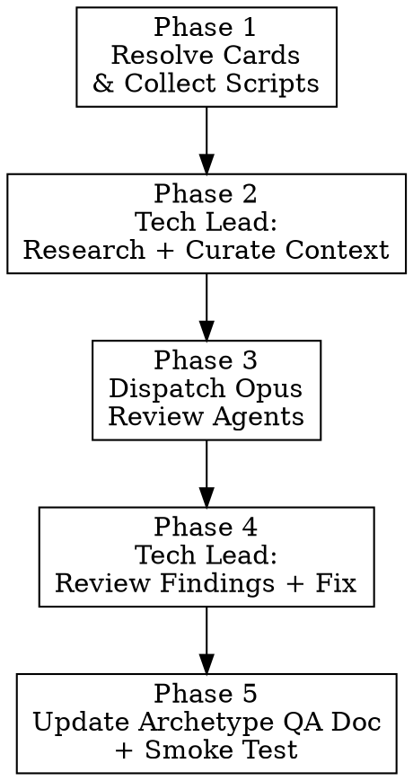

# Review Archetype Card Text Faithfulness

Systematic audit and fix of card scripts against official card text, using a tech lead agent for context curation and review, with Opus review agents for faithfulness verification.

## When to Use

- After `/implement-archetype` completes and you want to verify faithfulness
- When reviewing scripts that were auto-generated or bulk-implemented
- When a QA report exists but you want deeper clause-by-clause verification
- When archetype-qa docs are stale and need updating with current verdicts
- When running a faithfulness campaign across multiple archetypes

**Not for:** Runtime behavior testing (that's gameplay-qa). Not for crash-only smoke testing.

## Quick Reference

- **Engine API Reference**: `qa/archetype-qa/engine-api-reference.md`
- **C# Scripts**: `DCGO/Assets/Scripts/CardEffect/{SET}/{COLOR}/{CARD_ID}.cs` (underscore convention: BT17-001 = BT17_001.cs)
- **Python Scripts**: `digimon_gym/engine/data/scripts/{set_lower}/{set_lower}_{nnn}.py`
- **Deck Library**: `digimon_gym/engine/data/deck_library.json`
- **Engine Gaps**: `qa/archetype-qa/engine-gaps.md`
- **Existing QA Docs**: `qa/archetype-qa/{archetype_name}.md`
- **Pinecone Index**: `digimon-engine` (namespaces: engine-api, card-scripts, card-metadata, rules-docs)

## Overview



---

## Phase 1: Resolve Cards & Collect Scripts

### 1a. Determine card pool

If input contains `--cards`, use the provided comma-separated card IDs.
Otherwise, look up the archetype name in `deck_library.json`:

```python
import json
from pathlib import Path

lib = json.loads(Path('digimon_gym/engine/data/deck_library.json').read_text())
archetype = lib['archetypes'].get('ARCHETYPE_NAME', {})

all_cards = set()
for dl in archetype.get('decklists', []):
    all_cards.update(json.loads(dl['decklist']))

print(f'Unique cards: {len(all_cards)}')
```

### 1b. Collect per-card inputs

For each card ID:

1. **Python script**: Read from `digimon_gym/engine/data/scripts/{set}/{set}_{nnn}.py`
2. **C# reference**: Search `DCGO/Assets/Scripts/CardEffect/` for `{CARD_ID}.cs` using glob. Structure: `{SET}/{COLOR}/{CARD_ID}.cs` (e.g., `BT23/WHITE/BT23_057.cs`). Color subdirectory varies — use glob to find.
3. **Card metadata**: Fetch from Pinecone `card-metadata` namespace, or from local `cards.json` / DigimonCard.io API. Extract: name, kind, level, colors, traits, DP, play cost, effect text, inherited text, security text.
4. **Existing QA verdict** (if any): Check `qa/archetype-qa/{archetype}.md` for prior verdicts per card.

Skip cards with no Python script — report as MISSING in final output.

### 1c. Build card manifest

Organize cards into review batches:

| Batch Size | Criteria |
|------------|----------|
| 5-8 cards | Default per review agent |
| Same batch | Cards that reference each other by name/trait |
| Same batch | Tamers + their associated Digimon |

---

## Phase 2: Tech Lead Research + Context Curation

Spawn a dedicated Opus agent to research and curate context for the review agents. This mirrors implement-archetype's proven tech lead pattern.

Use `Agent` tool with `model: "opus"`.

### Tech Lead Prompt (Research Phase)

```
You are the tech lead for a Digimon TCG card faithfulness review.

## Your Task
Prepare curated engine context that review agents will use to audit scripts.

### Step 1: Identify mechanics needed
Scan all card effect text below. Build a deduplicated list of mechanics across all cards
(e.g., Blocker, Rush, cost reduction, alt-digi, DNA, Delay, suspend, de-digivolve, etc.)

### Step 2: Query Pinecone engine-api
For each mechanic, search namespace "engine-api" in index "digimon-engine".
Extract: method signatures, timing enums, required arguments, usage patterns.

### Step 3: Query Pinecone card-scripts for reference examples
Search namespace "card-scripts" with filter {is_frozen: true} for 3-5 proven frozen scripts
that demonstrate the key mechanic combinations used across these cards.

### Step 4: Check engine gaps
Cross-reference card effects against the Known Engine Gaps section below.
Flag any cards that are BLOCKED.

### Step 5: Gather cross-card references
For cards whose effect text references other cards by name, search "card-metadata" namespace
to determine whether references are name-based or trait-based.

### Output Format
Return a structured context pack:

## Curated Engine Context

### Mechanic: {name}
**API:** `game.method(args)` — description
**Timing:** EffectTiming.{value}
**Pattern:**
```python
{usage snippet}
```

### Few-Shot Examples
#### {CARD_ID} — {what it demonstrates}
```python
{frozen script}
```

### Cross-Card References
- {CARD_ID} references "{name}" — this is a [name/trait], verified via card-metadata

### Pre-Flagged BLOCKED Cards
- {CARD_ID}: {which engine gap it hits}

## Cards
{Include full manifest: card ID, name, kind, level, colors, traits, DP, play cost,
 effect text, inherited text, security text}

## Known Engine Gaps
{contents of qa/archetype-qa/engine-gaps.md}
```

---

## Phase 3: Dispatch Opus Review Agents

Dispatch review agents in parallel using `model: "opus"`. Each agent receives the tech lead's curated context pack.

**IMPORTANT:** Use Opus, not Sonnet. Faithfulness review requires judgment about ambiguous card text, multi-step selection flows, and name-vs-trait distinctions that Sonnet handles poorly.

### Review Agent Prompt Template

```
You are auditing Digimon TCG card effect scripts for FAITHFULNESS to the official card text.

## Your Task
For each card below, decompose the card text into effect clauses, then verify each clause
against the Python script. The C# implementation is the behavioral source of truth when
card text is ambiguous.

Report one of per card:
- **FAITHFUL**: Every clause correctly implemented
- **DISCREPANCY**: One or more clauses not faithfully implemented (list each)

## Error Checklist — Verify EVERY item for EVERY script

1. BeforePayCost condition MUST start with: `if context.get('card_source') is not card: return False`
2. [When Attacking] uses `EffectTiming.OnUseAttack` (28), NOT `OnAllyAttack` (32)
3. No stubs — every effect has a complete process callback with real logic (no `pass`)
4. Inherited effects have `is_inherited_effect = True` on SEPARATE `ICardEffect` instances
5. Alt-digi includes ALL qualifying traits/names from card text
6. Tamer [Start of Your Turn] checks `memory <= N` gate where card text specifies it
7. `register_modifier` args: `game.register_modifier(target_perm, ModifierType.X, value, condition=, expiry=)`
8. Option main = `EffectTiming.OptionSkill`; security = `EffectTiming.SecuritySkill`
9. "Ignore color requirements" conditions check specific context, NOT `return True`
10. Reveal flows use `game.effect_reveal_from_deck()`, NOT manual list ops or `trash_cards.pop()`
11. Target selections offer ALL valid targets; no auto-selection (`min(..., key=lambda)`)
12. Piercing: `game.effect_grant_piercing_factory()`
13. `OnTappedAnyone` callbacks verify the suspended Digimon is the correct target
14. DP modification: `register_modifier` with `CHANGE_DP` + expiry, NOT `perm.change_dp()`
15. Field presence: conditions check `card.permanent_of_this_card() is not None`
16. Use `player.battle_area`, NEVER `player.field_cards`

## Faithfulness Rules

### Clause Decomposition
For each card, self-decompose the text into clauses using these types:
- **Trigger**: bracket notation → correct EffectTiming enum
- **Condition**: "if" text → condition callback
- **Action**: game action → correct `game.effect_*` API call
- **Target**: scope/filters → correct selection API + filter function
- **Optionality**: "you may" → `is_optional=True`; no "may" → mandatory
- **Duration**: "for the turn" → `expiry='end_of_turn'`
- **Frequency**: [Once Per Turn] → once-per-turn guard
- **Inheritance**: below inheritance line → separate ICardEffect, `is_inherited_effect = True`
- **Security**: [Security] text → `EffectTiming.SecuritySkill`
- **Cost**: "By [doing X]" → X performed before effect resolves
- **Keyword**: `<Blocker>` etc. → correct keyword mechanism
- **Alt-Digi**: special digivolution → `_alt_digi_*` attributes

### Critical Common Bugs
- **Name vs Trait**: Card names → `contains_card_name()`; Traits → `has_trait()`. Wrong API silently fails.
- **Multi-Step Selections**: "trash from YOUR Digimon" then "1 of your Digimon gains..." → TWO separate selections. Check C# for multi-step `SelectPermanent` flows.
- **Player Agency**: "1 of your" or "any 1" → player must choose via selection phase. No auto-selection.
- **"By" Costs**: "By deleting 1 of your Digimon" → deletion is a COST that happens first. Not skippable.
- **Wrong Zone**: "from your trash" ≠ "from your hand". Verify zone in `effect_play_from_zone` calls.

## Curated Engine Context
{tech lead's context pack — mechanic snippets, few-shot examples, cross-references}

## Pinecone MCP (fallback for edge cases)
Index: "digimon-engine". Use when the curated context doesn't cover a mechanic:
- Engine API: search namespace "engine-api"
- Similar scripts: search namespace "card-scripts" with filter {is_frozen: true}
- Card metadata: search namespace "card-metadata"
- C# reference: search namespace "card-scripts" with filter {card_id: "CARD_ID"}

## Self-Recovery
If unsure about a method or pattern:
1. Check Curated Engine Context first
2. Search Pinecone "engine-api" namespace
3. Search Pinecone "card-scripts" for frozen examples
4. If still unsure, flag as UNCERTAIN rather than guessing

## Cards to Review

### {CARD_ID} — {card_name}
**Card Text:** {effect_text}
**Inherited Text:** {inherited_text}
**Security Text:** {security_text}
**Kind:** {kind} | **Level:** {level} | **Colors:** {colors} | **Traits:** {traits}

**Current Python Script:**
```python
{script contents}
```

**C# Reference:**
```csharp
{c# contents, or "Not available"}
```

**Prior QA Verdict:** {PASS/FAIL/IMPLEMENTED/BLOCKED/none}

(repeat for each card)

## Output Format

For each card:
```
### {CARD_ID} — {card_name}: FAITHFUL
All N clauses verified. [One-line summary of what was checked]
```
or
```
### {CARD_ID} — {card_name}: DISCREPANCY
Clauses verified: N/total

**{clause_type}: MISMATCH**
- Card text: "{exact quote}"
- Script does: {actual behavior}
- Expected: {correct behavior}
- Severity: critical|high|medium|low
- Fix: {specific fix — file, what to change}
```
or
```
### {CARD_ID} — {card_name}: BLOCKED
- Engine gap: {description}
- Effect text: "{text that can't be implemented}"
```

Do NOT report code style, naming, or structural issues.
ONLY report faithfulness mismatches where script behavior differs from card text.
```

---

## Phase 4: Tech Lead Review + Fix

After all review agents return, resume the tech lead agent with the findings.

### Tech Lead Resume Prompt (Review + Fix Phase)

```
## Phase: Review + Fix

Review agents have returned their findings. For each DISCREPANCY:

1. **Triage** — Confirm the discrepancy is real (not a false positive from the agent misunderstanding engine patterns). Check against the Error Checklist and curated context.

2. **Classify** per fix:
   - SIMPLE-FIX: Wrong enum, missing guard, wrong argument, minor condition error
     → Apply the fix directly (read file, edit, confirm)
   - COMPLEX-FIX: Wrong effect logic, missing entire effect, needs significant rewrite
     → Write specific fix instructions for a follow-up agent
   - BLOCKED: Hits engine gap → log to engine-gaps.md
   - FALSE-POSITIVE: Agent was wrong → dismiss with reason

3. **Apply all SIMPLE-FIX changes** directly by editing the script files.

4. **For COMPLEX-FIX**: Write the corrected script yourself if feasible (you have full context).
   Only delegate to a sub-agent if the fix requires implementation beyond your current context.

### Review Agent Findings
{paste each agent's full output}

### Output Format
For each card:
```
CARD_ID: FAITHFUL (confirmed)
```
or
```
CARD_ID: FIXED
- Fix applied: {description}
```
or
```
CARD_ID: COMPLEX-FIX
- Problem: {description}
- Fix instructions: {specific steps}
```
or
```
CARD_ID: BLOCKED
- Engine gap: {description}
```
or
```
CARD_ID: FALSE-POSITIVE
- Agent said: {what agent reported}
- Reality: {why it's actually correct}
```
```

### Handling COMPLEX-FIX

For any COMPLEX-FIX cards the tech lead couldn't fix directly, dispatch a new Opus agent with:
- The specific card's text, script, C# reference
- The tech lead's fix instructions
- The curated context pack

One revision round maximum per card.

---

## Phase 5: Update QA Doc + Verify

### 5a. Update the existing archetype-qa doc

**Update `qa/archetype-qa/{archetype_name}.md` directly** — do NOT create a separate faithfulness file.

Format:
```markdown
# Archetype QA: {archetype_name}
Date: {today} (reviewed)
Total cards: N

## Summary
- FAITHFUL: N
- FIXED: N (this review)
- BLOCKED: N (engine gaps)
- MISSING SCRIPT: N

## Card-by-Card Verdicts
| Card ID | Name | Verdict | Notes |
|---------|------|---------|-------|
| {ID} | {name} | FAITHFUL | All clauses verified |
| {ID} | {name} | FIXED | {one-line fix summary} |
| {ID} | {name} | BLOCKED | {engine gap reference} |

## Fixes Applied (This Review)
### {CARD_ID} {card_name}
- {description of what was changed and why}

## Blocked Cards
### {CARD_ID} {card_name}
- Effect text: "{...}"
- Engine gap: {description}

## Prior QA Contradictions
{Cards where prior verdict disagreed with current findings}
```

Also update `qa/archetype-qa/INDEX.md` with revised status for this archetype.

### 5b. Targeted debug game verification

For each FIXED card (and any DISCREPANCY cards that were complex), run a targeted debug game that exercises the specific effect. Debug games are superior to smoke tests because they verify the exact behavior, not just crash-freedom.

**Method:** Use the debug game API to set up controlled board states that trigger each fixed card's effects.

```bash
# Start server (if not running)
python -m uvicorn digimon_gym.api:app --host 0.0.0.0 --port 8000

# Create debug game with controlled deck order
curl -X POST http://localhost:8000/debug/games -H 'Content-Type: application/json' -d '{
  "deck1": [...],
  "deck2": [...],
  "skip_shuffle": true,
  "starting_hand1": ["CARD_ID_TO_TEST", ...],
  "initial_memory": 10
}'
```

**For each fixed card, the debug game should:**
1. Place the card in the starting hand (via `starting_hand1`)
2. Set memory high enough to play it (via `initial_memory`)
3. Arrange opponents/targets in the deck order so they appear on the board
4. Play the card and verify:
   - Selection phases enter correctly (check action mask for expected options)
   - Targets/filters match card text (correct candidates offered)
   - State changes happen (DP changes, cards move to correct zones, memory changes)
   - Costs are paid (cards trashed, Digimon deleted, etc.)
   - Duration is correct (effects expire at the right time)

**Inject cards as needed:**
```bash
# Inject a card to a specific zone during gameplay
curl -X POST http://localhost:8000/debug/games/{id}/inject-card -d '{"card_id": "CARD_ID", "zone": "hand"}'

# Set memory
curl -X POST http://localhost:8000/debug/games/{id}/set-memory -d '{"memory": 10}'

# Check internal state
curl http://localhost:8000/debug/games/{id}/internal-state

# Check action mask
curl http://localhost:8000/games/{id}/action-mask
```

**Report format per card:**
```
CARD_ID: DEBUG-VERIFIED
- Setup: {what board state was created}
- Trigger: {what action triggered the effect}
- Verified: {what behavior was confirmed correct}
```
or
```
CARD_ID: DEBUG-FAILED
- Setup: {board state}
- Expected: {correct behavior per card text}
- Actual: {what happened}
- Root cause: {analysis}
```

Fix any DEBUG-FAILED cards and re-verify.

### 5c. Ingest updated scripts to Pinecone (if fixes were applied)

```bash
python tools/ingest_pinecone.py --namespace card-scripts --set {set_id}
```

---

## Flags

- `--report-only`: Only report discrepancies, don't fix (default: review AND fix)
- `--severity critical,high`: Only report/fix at specified severity levels
- `--cards CARD1,CARD2,...`: Review specific cards instead of full archetype
- `--skip-c-sharp`: Don't fetch C# references (faster, less accurate)
- `--skip-smoke-test`: Skip post-fix verification
