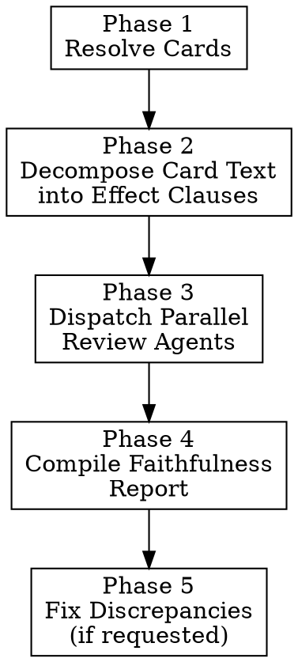

# Review Archetype Card Text Faithfulness

Systematic audit of implemented card scripts against official card text, using Pinecone for card metadata and reference scripts.

## When to Use

- After `/implement-archetype` completes and you want to verify faithfulness
- When reviewing scripts that were auto-generated or bulk-implemented
- When a QA report exists but you want deeper clause-by-clause verification

**Not for:** Code quality or structural review (that's implement-archetype Phase 3C). Not for runtime behavior testing (that's gameplay-qa).

## Overview



---

## Phase 1: Resolve Cards & Scripts

### 1a. Determine card pool

Same as implement-archetype Phase 1a — parse archetype from `deck_library.json` or `--cards` list.

### 1b. Collect inputs per card

For each card ID:

1. **Python script**: Read from `digimon_gym/engine/data/scripts/{set}/{set}_{nnn}.py`
2. **Card metadata**: Query Pinecone `card-metadata` namespace in index `digimon-engine` using the card ID. Extract the full effect text, inherited text, security text, card kind, level, traits, colors, DP, play cost.
3. **C# reference** (strongly recommended): Query Pinecone `card-scripts` namespace with filter `{card_id: "CARD_ID"}` for the C# source. The C# implementation is the **behavioral source of truth** when card text is ambiguous. It resolves name-vs-trait questions (`EqualsCardName` vs `EqualsTraits`), multi-step selection flows, and filter scope.
4. **Existing QA report** (if any): Check `docs/archetype-qa/{archetype}.md` for prior verdicts.

Skip cards with no Python script (report as MISSING).

---

## Phase 2: Decompose Card Text into Effect Clauses

Before dispatching agents, decompose each card's text into discrete **effect clauses** that the agents will verify. This is done by the orchestrator (you) to ensure consistent granularity.

### Clause Types

| Clause Type | Pattern in Card Text | What to Verify in Script |
|-------------|---------------------|--------------------------|
| **Trigger** | "[When Digivolving]", "[When Attacking]", "[Start of Your Turn]" | Correct `EffectTiming` enum |
| **Condition** | "If you have 3+ ...", "When ... has [Trait]" | `condition` callback checks the right thing |
| **Action** | "gain +2000 DP", "draw 1", "trash 1 card" | Correct `game.effect_*` API call |
| **Target** | "1 of your opponent's Digimon", "all of your Security Digimon" | `effect_select_*` scope and filters |
| **Optionality** | "you may", "up to" | `is_optional=True` or `min_count=0` |
| **Duration** | "for the turn", "until end of opponent's turn" | `expiry=` on modifier |
| **Frequency** | "[Once Per Turn]" | Once-per-turn guard in condition |
| **Inheritance** | Effects below the inheritance line | `is_inherited_effect = True` on separate `ICardEffect` |
| **Security** | "[Security]" text | `EffectTiming.SecuritySkill` timing |
| **Cost** | "By [doing X]", "by paying N memory" | Cost is checked/deducted before effect executes |
| **Keyword** | "<Blocker>", "<Rush>", "<Piercing>" | Keyword granted or checked correctly |
| **Alt-Digi** | "can digivolve into ... ignoring color" | `_alt_digi_*` attributes complete |

### Example Decomposition

Card: **BT23-014 Gankoomon** (effect text)
```
[When Digivolving] [Once Per Turn] If you have a Tamer in play, this Digimon gains
<Blocker> and <SecurityAttack+1> for the turn.
```

Clauses:
1. **Trigger**: [When Digivolving] → `EffectTiming.OnDigivolve`
2. **Frequency**: [Once Per Turn] → once-per-turn guard
3. **Condition**: "If you have a Tamer in play" → checks `player.battle_area` for tamer permanents
4. **Action 1**: "gains <Blocker>" → `register_modifier(ModifierType.GRANT_BLOCKER, ...)`
5. **Action 2**: "gains <SecurityAttack+1>" → `register_modifier(ModifierType.CHANGE_SECURITY_ATTACK, 1, ...)`
6. **Duration**: "for the turn" → `expiry='end_of_turn'`

Include this decomposition in the agent prompt so they know exactly what to verify.

---

## Phase 3: Dispatch Parallel Review Agents

### Batch sizing

- **8-12 cards per agent** (review-only is lighter than implementation)
- Group cards that reference each other in the same batch

### Agent model

Use `model: "sonnet"` — review agents are read-only and don't need worktrees.

### Review Agent Prompt Template

```
You are auditing Digimon TCG card effect scripts for FAITHFULNESS to the official card text.

## Your Task
For each card below, you are given:
- The official card text (source of truth)
- A decomposition into effect clauses (what to verify)
- The current Python script
- Optionally, a C# reference script

Compare the Python script against EVERY clause. Report one of:
- **FAITHFUL**: Every clause is correctly implemented
- **DISCREPANCY**: One or more clauses are not faithfully implemented

## Faithfulness Criteria

For each clause, verify:

### Triggers
- Timing enum matches card text bracket notation exactly
- [When Digivolving] = OnDigivolve (6), [When Attacking] = OnUseAttack (28)
- [Start of Your Turn] = OnStartTurn (3), [End of Attack] = OnEndAttack (29)
- [On Play] = OnEnterField (5), [On Deletion] = OnDestroyAnyone (15)
- [All Turns] triggers use the ALL variant where applicable
- Don't confuse OnAllyAttack (32) with OnUseAttack (28)

### Conditions
- Every "if" in card text has a matching condition callback
- Trait checks use `has_trait()` — name checks use `contains_card_name()`
- "in play" checks scan `player.battle_area` (never `player.field_cards`)
- Numeric thresholds (3+, 5+) match the card text exactly
- Owner scope: "your" = owner's field, "opponent's" = opponent's field

### Actions
- Every action in card text has a corresponding `game.effect_*` call
- draw = `effect_draw`, trash = `effect_trash_cards`, return = `effect_return_to_hand`
- DP change = `register_modifier(ModifierType.CHANGE_DP, ...)` with correct value and expiry
- Play from trash/hand = `effect_play_card_from_hand` / appropriate play method
- Reveal = `effect_reveal_from_deck` (never manual list operations)

### Targets
- Target scope matches card text exactly
- "1 of your opponent's Digimon" → `effect_select_opponent_permanent` with count=1
- "all of your Digimon" → iterate `player.battle_area` (no selection needed)
- Level/DP/color/trait filters in target selection match card text

### Optionality
- "you may" → `is_optional=True` on the effect OR `min_count=0` on selection
- No "you may" → effect is mandatory (is_optional defaults to False)
- "up to N" → max_count=N with min_count=0

### Duration
- "for the turn" → `expiry='end_of_turn'`
- "until the end of your opponent's turn" → `expiry='end_of_opponent_turn'`
- Permanent (no duration stated) → `expiry='permanent'` or no expiry

### Frequency
- [Once Per Turn] → condition checks a turn-scoped flag
- No frequency marker → can fire multiple times

### Inheritance
- Effects below the card's inheritance line → `is_inherited_effect = True`
- Must be on separate ICardEffect instances
- Inherited effects should work when the card is in a digivolution stack

### Security
- [Security] text → timing = EffectTiming.SecuritySkill
- Security effect is a SEPARATE ICardEffect from the main effect

### Costs
- "By [doing X]" → X is performed as a cost, not the reward
- "by suspending this Digimon" → perm.suspend() called as part of cost
- "by trashing N cards" → cards trashed before effect resolves

### Multi-Step Selections (CRITICAL — common bug)
- "By trashing from YOUR Digimon" then "1 of your SUCH Digimon gains..." → TWO separate selections
- The source Digimon (where you trash from) and the target Digimon (who receives buffs) CAN be different
- Check C# reference for multi-step `SelectPermanent` flows — Python scripts often merge steps incorrectly
- Player agency: if card says "any 1" or "1 of your", the player must choose — no auto-selection

### Keywords
- <Blocker>, <Rush>, <Piercing>, etc. → correct keyword grant method
- Piercing specifically uses `game.effect_grant_piercing_factory()`
- Keywords "for the turn" → modifier with expiry

### Name vs Trait (CRITICAL — common bug)
- Card names (e.g., "Close", "Omnimon") → `contains_card_name("name")`
- Traits (e.g., "Royal Knight", "Mineral") → `has_trait("trait")`
- These are DIFFERENT APIs — using the wrong one silently fails
- When in doubt, query Pinecone card-metadata for the referenced card

## Pinecone MCP — Use for Verification
Index: "digimon-engine"

When unsure about a mechanic, API, or card reference:
- **Engine API**: Search namespace "engine-api" for method signatures and patterns
- **Similar scripts**: Search namespace "card-scripts" with filter `{is_frozen: true}` for proven implementations of similar effects
- **Card references**: Search namespace "card-metadata" when a card references another card by name — verify whether the reference is a name or trait
- **C# cross-reference**: Search namespace "card-scripts" with filter `{card_id: "CARD_ID"}` for the original C# implementation — use as tie-breaker for ambiguous card text (e.g., whether "[Close]" is a name or trait, whether a filter accepts Rock OR Mineral)

## Cards to Review

{For each card, include:}

### {CARD_ID} — {card_name}
**Card Text:** {effect_text}
**Inherited Text:** {inherited_text}
**Security Text:** {security_text}
**Kind:** {kind} | **Level:** {level} | **Colors:** {colors} | **Traits:** {traits}

**Effect Clauses to Verify:**
1. {clause_type}: {description} → expected: {what the script should do}
2. {clause_type}: {description} → expected: {what the script should do}
...

**Current Python Script:**
```python
{script contents}
```

**C# Reference (if available):**
```csharp
{c# contents}
```

## Output Format

For each card, output:
```
### {CARD_ID} — {card_name}: FAITHFUL
All {N} clauses verified.
```
or
```
### {CARD_ID} — {card_name}: DISCREPANCY
Clauses verified: {N}/{total}

**Clause {N} ({clause_type}): MISMATCH**
- Card text says: "{exact quote from card}"
- Script does: {what the script actually does}
- Expected: {what it should do}
- Severity: critical|high|medium|low
- Suggested fix: {brief description}

**Clause {M} ({clause_type}): MISSING**
- Card text says: "{exact quote}"
- Script: No corresponding implementation found
- Severity: critical
```

Do NOT report code style issues, naming preferences, or structural concerns.
ONLY report faithfulness mismatches where the script's behavior would differ from the card text.
```

---

## Phase 4: Compile Faithfulness Report

Merge all agent results into `docs/archetype-qa/{archetype_name}-faithfulness.md`:

```markdown
# Card Text Faithfulness Review: {archetype_name}
Date: {today}
Total cards reviewed: N

## Summary
- FAITHFUL: N
- DISCREPANCY: N (X critical, Y high, Z medium, W low)
- MISSING SCRIPT: N

## Discrepancies

### Critical
#### {CARD_ID} — {card_name}
- **Clause**: {clause_type} — "{card text quote}"
- **Issue**: {description}
- **Fix**: {suggested fix}

### High
...

### Medium
...

### Low
...

## Faithful Cards
{CARD_ID}, {CARD_ID}, ... (comma-separated list)

## False Positives from Prior QA
{List any cards marked QA-FAIL in prior reports that are actually FAITHFUL,
 or vice versa — cards marked PASS that have discrepancies}
```

Cross-reference against the existing QA report (if any) in `docs/archetype-qa/{archetype_name}.md` to flag contradictions.

---

## Phase 5: Fix Discrepancies (Optional)

Only if the user requests fixes (or pass `--fix` flag).

For each DISCREPANCY:
1. Read the Python script
2. Apply the suggested fix from the review agent
3. Verify the fix addresses the clause mismatch

For critical/high discrepancies, consider re-querying Pinecone `card-scripts` namespace with `{is_frozen: true}` filter for proven implementations of the same mechanic.

After fixes, re-run the review on fixed cards only to confirm FAITHFUL.

---

## Flags

- `--fix`: Apply fixes for discrepancies found (default: report only)
- `--severity critical,high`: Only report discrepancies at specified severity levels
- `--cards CARD1,CARD2,...`: Review specific cards instead of full archetype
- `--skip-c-sharp`: Don't fetch C# references (faster, less cross-reference)
